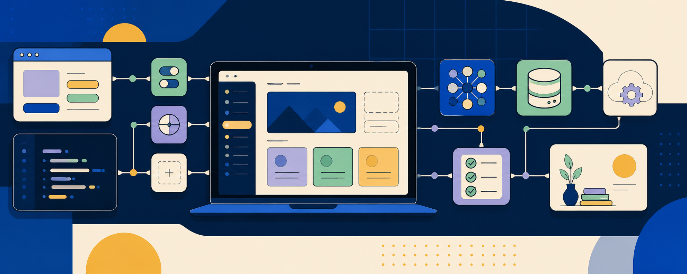

  

<h1 align="center">Hi, I'm Chadapohn 👋</h1>

  <strong>Full-stack developer building thoughtful, production-ready web products.</strong>

  I work across responsive interfaces, typed APIs, databases, testing, and cloud deployment—turning product ideas into reliable experiences people can actually use.

  <a href="https://herbiware.com">Portfolio</a>
  ·
  <a href="https://vocab-learning-app.hoshiku1997.workers.dev">Live project</a>
  ·
  <a href="https://github.com/potatodevsr/vocab-learning-app">Featured repository</a>

## What I work with

`TypeScript` · `React` · `Next.js` · `Node.js` · `Hono` · `Prisma` · `SQL` · `Cloudflare Workers` · `Tailwind CSS` · `Playwright` · `Cypress`

## Featured work

### [Vocab Learning](https://github.com/potatodevsr/vocab-learning-app)

A bilingual Thai vocabulary platform that turns familiar Oxford 3000 English prompts into short, structured lessons.

- Built an end-to-end learning flow with word cards, quizzes, progress tracking, mastery, and review
- Delivered a responsive English/Thai interface with installable PWA support
- Designed a typed full-stack architecture using Next.js, Hono, Prisma, and Cloudflare D1
- Added authentication, internationalization, analytics, SEO, and automated end-to-end coverage
- Deployed the web application and API independently on Cloudflare Workers

**[Try the live app →](https://vocab-learning-app.hoshiku1997.workers.dev)**

## How I build

- Start from the user journey and make the smallest complete experience work
- Keep boundaries typed from the database through the API to the interface
- Treat accessibility, responsive behavior, and loading/error states as product features
- Protect important flows with focused integration and end-to-end tests
- Ship with deployment, observability, and maintainability in mind

## Currently

I'm open to opportunities where I can contribute across frontend and backend, collaborate closely with product teams, and keep growing through real-world engineering challenges.

---

  <a href="https://github.com/potatodevsr?tab=repositories">Explore my repositories</a>

